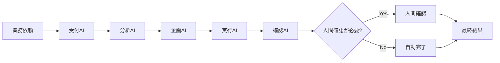

# AI社員・AI部署 業務フロー設計 PoC

複数のAI役割を「AI社員」「AI部署」として分担させ、
**受付 → 分析 → 企画 → 実行 → 確認 → 人間確認 → 出力**
までを流す、小さな業務自動化PoCです。

このリポジトリは実際の社内システム本体ではなく、AI社員・AI部署という考え方を安全に公開するためのサンプルです。
外部AI APIは使わず、Python標準ライブラリだけで動作します。

## 想定している課題
- 毎回人間が細かく指示しないと動かない
- AIの担当範囲が曖昧
- AI出力を全部人間が確認している
- 失敗時にどこで止まったか分からない
- AIを増やすほど運用が複雑になる

## 業務フロー



## 実行方法

```bash
python -m src.main sample_request.json
```

出力:
```text
output/result.json
output/run.log
```

## テスト

```bash
python -m unittest discover tests
```

## PoCで自動化した範囲
- 業務依頼受付
- 業務カテゴリ分類
- 担当部署提案
- リスク判定
- 処理フロー生成
- 人間確認ポイント判定
- JSON出力
- 実行ログ

## 人間確認を残す設計
外部公開、高リスク、機密情報を含む処理は人間確認へ回します。
「AIが処理し、人間は重要な判断だけ確認する」構成を想定しています。

## API費用
このPoCは外部LLM APIを使わないため、APIキー不要・API費用0円です。
業務フローの有効性を確認してから、必要部分だけChatGPTやClaude等へ置き換える想定です。

## 本実装の拡張例
- ChatGPT / Claude API
- Discord / Slack
- Notion / Google Drive
- Gmail
- 定時処理
- AI社員間の引き継ぎ
- 承認ボタン
- 実行履歴・監査ログ
- リトライ
- APIコスト管理

## 設計思想
1. 業務を分解する
2. AIごとの役割を決める
3. AIに任せる範囲を決める
4. 人間判断ポイントを残す
5. 失敗時に追跡できるようにする
6. 効果を確認してから本実装する

## License
MIT
